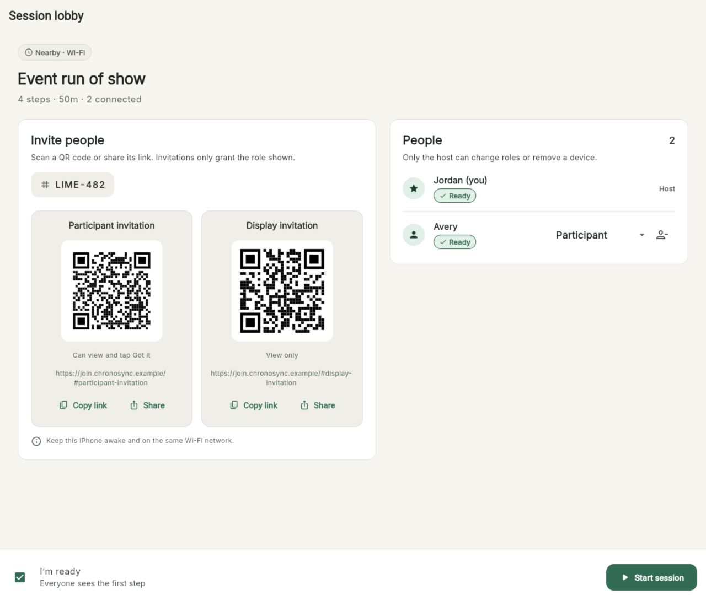

# ChronoSync

[](https://github.com/jpwhite3/chronosync-app/actions/workflows/ci.yml)
[](https://github.com/jpwhite3/chronosync-app/actions/workflows/security.yml)

ChronoSync is an account-free, local-first timed runbook for live event teams.
Create a plan, run it from iPhone, Mac, or the web, and keep every role aligned
on the current step, next step, remaining time, and schedule variance.

> **Project status:** ChronoSync is under active development. There is no tagged
> public release yet, and configuration still contains placeholder application
> identifiers. It is suitable for development and evaluation, not production
> deployment.



## Highlights

- Build reusable plans with ordered, timed steps, cues, scheduled starts, and
  optional auto-advance.
- Run solo or share a live session as Host, Controller, Participant, or Display.
- Host nearby sessions from a foreground iPhone without Internet access.
- Host anonymous online sessions through the optional Cloudflare relay.
- Keep plans and history on the local device unless they are explicitly
  exported.
- Move plans with versioned `.chronosync` archives and export activity as CSV.
- Recover interrupted solo sessions and review planned-versus-actual results.

## Supported Platforms

| Platform | Full app | Host nearby | Host online | Join/display |
| --- | --- | --- | --- | --- |
| iPhone | Yes | Yes | Yes, when configured | Yes |
| macOS | Yes | No | Yes, when configured | Yes |
| Web/PWA | Yes | No | Yes, when configured | Yes |
| Apple Watch | Planned after MVP | — | — | — |

Flutter runners for Android, Linux, and Windows are present, but they are not
currently supported product targets.

## Quick Start

Prerequisites are Flutter 3.41.9 (including a Dart SDK compatible with
`^3.11.5`), Node.js 22, npm, and Chrome. iPhone and Mac work additionally
require macOS, Xcode, an installed iOS Simulator runtime, and CocoaPods.

```sh
git clone https://github.com/jpwhite3/chronosync-app.git
cd chronosync-app
make doctor
make setup
make run-web
```

Other common entry points:

```sh
make run-macos                     # Native Mac app
make ios-simulators                # Show available iPhone simulators
make run-ios                       # Run on the first available simulator
make devices                       # List all Flutter device IDs
make run DEVICE=<device-id>        # Run on a selected device
make check                         # App, browser, and relay quality checks
make help                          # Every supported development recipe
```

See the [developer quick start](docs/development/quickstart.md) for installation
details and [local development](docs/development/local-development.md) for
online rooms, build variants, generated assets, and device configuration.

## Documentation

- [User guide](docs/README.md) — step-by-step iPhone, Mac, web, and shared-session
  instructions with screenshots.
- [Developer handbook](docs/development/README.md) — setup, architecture,
  testing, relay development, releases, and troubleshooting.
- [Contributing](CONTRIBUTING.md) — TDD workflow, standards, and pull-request
  checklist.
- [Architecture](docs/development/architecture.md) — boundaries, state model,
  persistence, transports, and security design.
- [Security policy](SECURITY.md) — how to disclose a vulnerability privately.
- [Support](SUPPORT.md) — where to ask questions or report a problem.
- [Changelog](CHANGELOG.md) — notable changes awaiting the first release.

## Repository Layout

```text
chronosync/              Flutter application and platform runners
  lib/                   Presentation, logic, domain, data, and core layers
  test/                  Unit, repository, transport, and widget tests
  tool/                  Code generation, release, and branding tools
relay/                   Cloudflare Worker, Durable Object, and Vitest suite
docs/                    User guide and developer handbook
specs/                   Feature requirements, contracts, and implementation plans
.github/workflows/       Continuous integration
```

The active implementation uses immutable `Plan` and `LiveSession` domain
models, Drift persistence, `LiveSessionController`, and host-authoritative
session transports. Read the architecture guide before changing session state,
persistence, or synchronization behavior.

## Privacy and Security

ChronoSync has no accounts and sends no product analytics by default. Online
session payloads are end-to-end encrypted; the relay coordinates opaque room
state and does not receive decrypted plans. Nearby traffic is authenticated and
encrypted at the application layer, but nearby sessions are intended for
trusted local networks. Invitation links contain capabilities: treat them as
secrets and never include them in issues, logs, screenshots, or test fixtures.

For suspected vulnerabilities, read [SECURITY.md](SECURITY.md) and establish a
private channel before sharing technical details.

## Contributing

Issues, design feedback, and careful bug reports are welcome. External pull
request merges are paused until the project owner selects a license and inbound
contribution terms. The workflow in [CONTRIBUTING.md](CONTRIBUTING.md) documents
how authorized collaborators work: use test-driven development for behavior
changes and run `make check` before review.

## License

An open-source license has not yet been selected. Until a license file is
added, the source remains under its default copyright terms. Discuss substantial
external contributions with the maintainer first.
