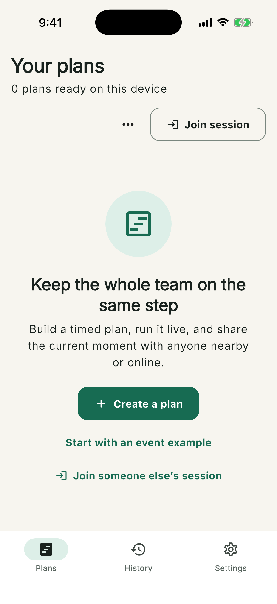

# ChronoSync User Guide

ChronoSync is an account-free timed runbook for keeping a team on the same
step. Build a **Plan**, run it as a **Live session**, and let teammates follow
as a Controller, Participant, or fullscreen Display.

This guide describes the current iPhone, web/PWA, and native Mac apps. The
screenshots use the current application UI and representative event data; QR
codes and invitation links shown in the guide are examples, not active rooms.

## Choose Your Device

| Device | Create and edit | Host solo | Host nearby | Host online | Join | Display |
| --- | --- | --- | --- | --- | --- | --- |
| [iPhone](iphone.md) | Yes | Yes | **Yes** | Yes, when configured | Yes | Yes |
| [Web/PWA](web.md) | Yes | Yes | No | Yes, when configured | Yes | Yes |
| [Mac](macos.md) | Yes | Yes | No | Yes, when configured | Yes | Yes |
| Apple Watch | Not yet available | — | — | — | — | — |

Nearby hosting is an iPhone-only feature. Mac and web devices can still join a
nearby session. Online rooms require Internet access and a ChronoSync build
configured with the online relay.

## Start Here

1. Read [Create, Run, and Review a Plan](core-workflow.md) for the complete
   first-session walkthrough.
2. Open the guide for your device:
   [iPhone](iphone.md), [web/PWA](web.md), or [Mac](macos.md).
3. Use [Shared Sessions and Roles](shared-sessions.md) before coordinating a
   group.
4. See [Data, Recovery, and Troubleshooting](data-and-troubleshooting.md) for
   import/export, interrupted sessions, and common problems.

## Three Things to Know

- **There are no accounts.** Your device gets a random local identity. Set the
  name teammates will see under **Settings**.
- **Data is local by default.** Plans and history do not synchronize
  automatically. Export a `.chronosync` file to move Plans to another device.
- **The host stays authoritative.** During a shared session, the host app or
  page must remain open. If it becomes unavailable, guests freeze the last
  verified timer and show **Connection stale**.

## Terminology

- **Plan:** a reusable ordered list of timed Steps.
- **Step:** a title, duration, optional auto-advance behavior, and cue settings.
- **Live session:** one run of a Plan with actual timing and activity history.
- **Got it:** an acknowledgement of the current Step. It never advances the
  session.
- **Variance:** how far the session is ahead of or behind the original planned
  schedule.

Apple Watch, account sync, collaborative Plan editing, nearby hosting from Mac
or web, host failover, spreadsheet import, advanced analytics, and medical or
Health workflows are future features and are not documented as available.

## Developing ChronoSync

Contributors should use the [Developer Handbook](development/README.md) for
setup, architecture, test-driven development, relay operations, releases, and
troubleshooting. The repository-wide contribution policy is in
[CONTRIBUTING.md](../CONTRIBUTING.md).
