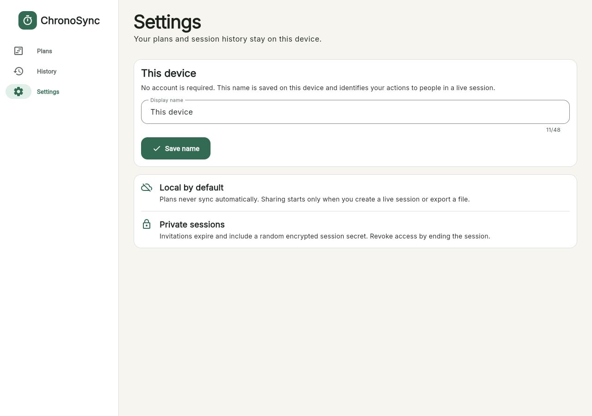
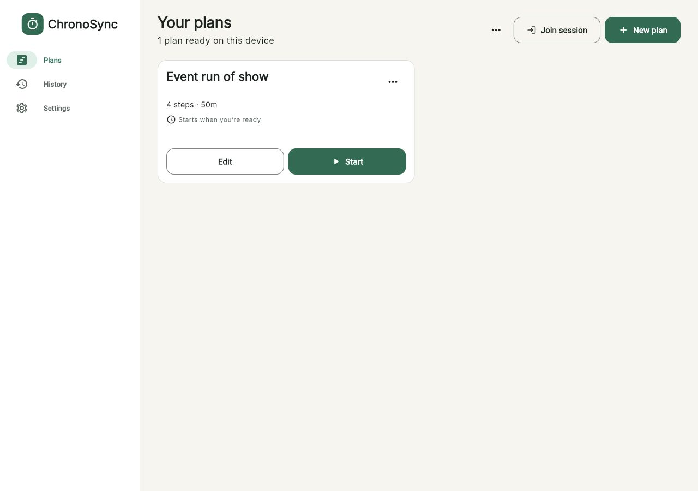
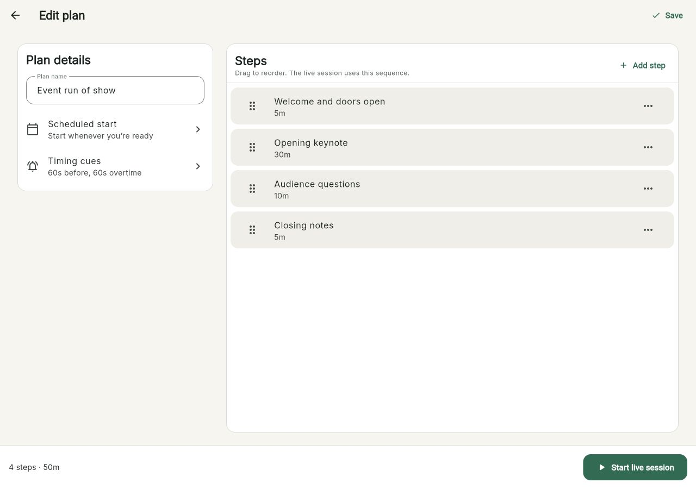
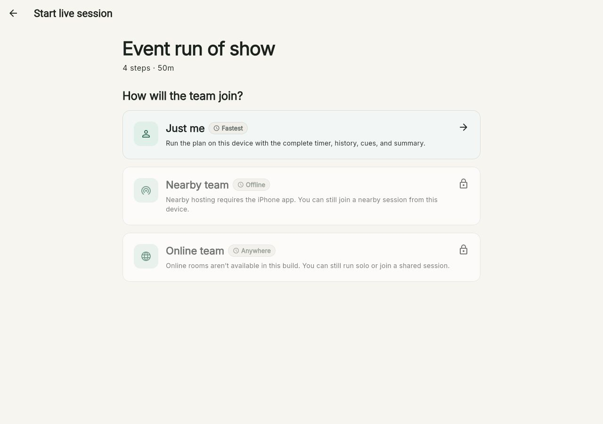
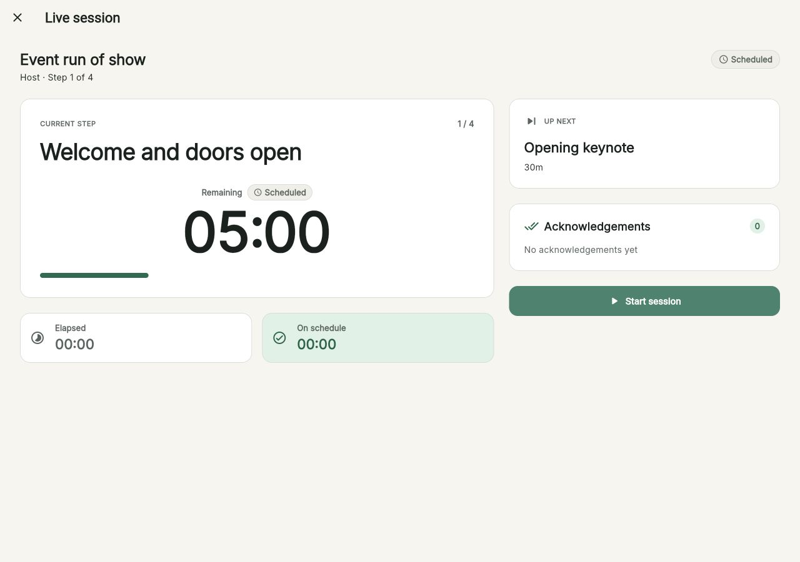
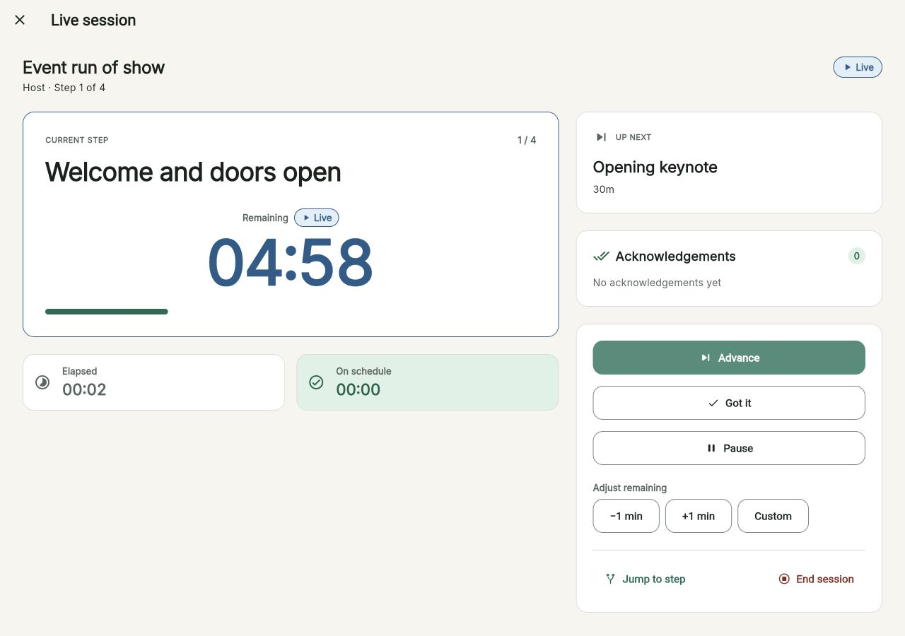
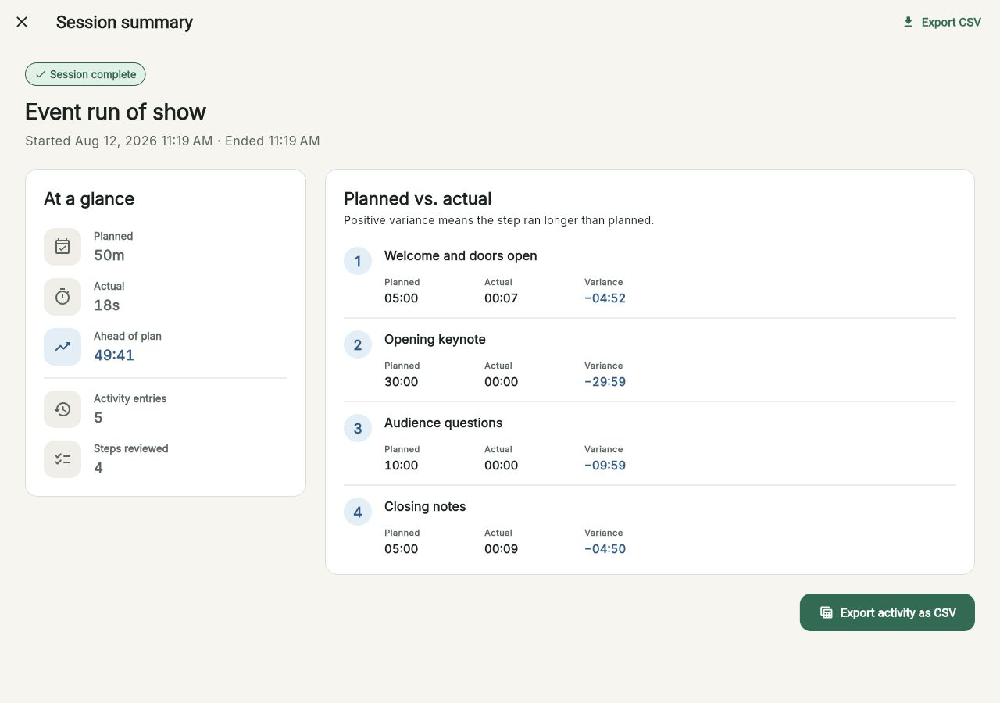
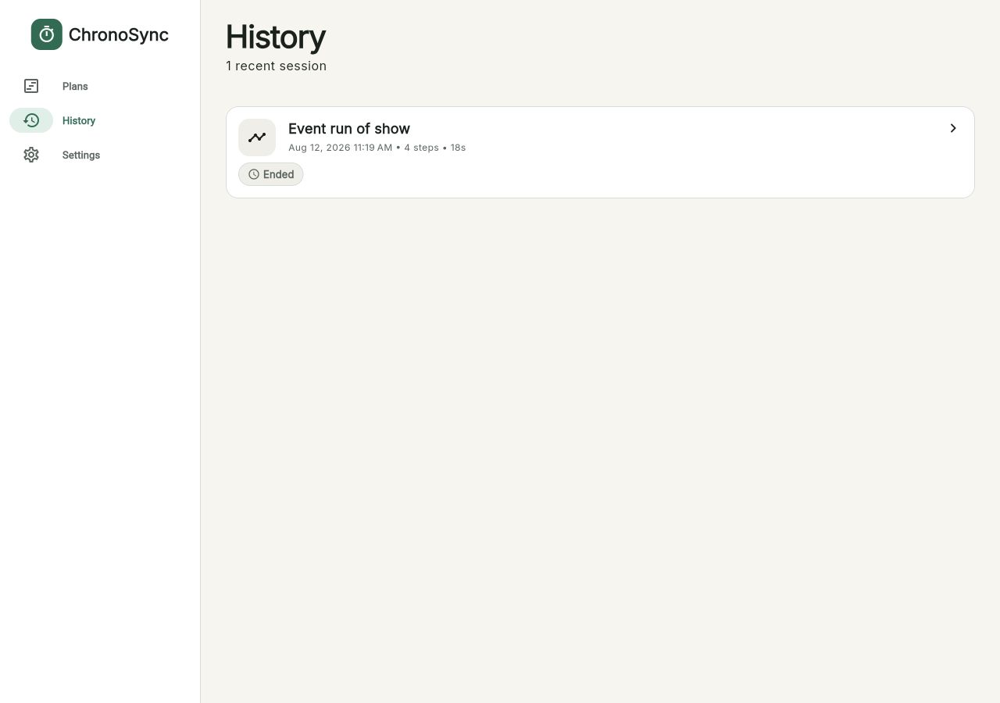

# Create, Run, and Review a Plan

The Plan editor and Live session controls work the same way on iPhone, web,
and Mac. Layouts adapt to the screen size, but labels and behavior stay
consistent.

## 1. Set the Device Name

1. Open **Settings** from the bottom navigation on iPhone or the navigation
   rail on a wide screen.
2. Enter a short **Display name**, such as `Stage manager` or `Front of house`.
3. Select **Save name**.

The name is stored only on this device and identifies its actions in shared
session history. No account is created.

## 2. Create a Plan

For the fastest tour, open **Plans** and select **Start with an event example**.
ChronoSync creates an **Event run of show** with four sample Steps and opens it
in the editor.

To start from scratch:

1. Select **Create a plan** in an empty library or **New plan** in a populated
   library.
2. Enter a **Plan name**.
3. Select **Create**.

Each Plan card shows its Step count, total runtime, and scheduled start. Use
**Edit** to change it or **Start** to run it. The Plan menu also provides
**Duplicate**, **Export**, and **Delete**. Deleting a Plan does not delete its
past session history.

## 3. Build the Runbook

In **Edit plan**:

1. Change the title in **Plan name** if needed.
2. Select **Add step**.
3. Enter a **Step title**, **Minutes**, and **Seconds**. A Step must last from
   one second to 99 hours.
4. Enable **Auto-advance** if the next Step should begin when this timer reaches
   zero.
5. Optionally enable **Custom timing cues** to override the Plan defaults for
   this Step.
6. Select **Add step** or **Save step**.
7. Repeat for the remaining Steps.

Drag a Step by its handle to reorder it. Its menu also offers **Move up**,
**Move down**, **Edit**, **Duplicate**, and **Delete**. The footer continuously
shows the Step count and total planned runtime.

### Schedule a Start

Select **Scheduled start**, choose a date and time, and confirm. The active
session can begin automatically at that time. Clear the schedule with the
close control beside it when the Plan should instead start whenever the host
is ready.

### Configure Timing Cues

Select **Timing cues** to set:

- the approaching threshold in seconds before zero;
- the overtime threshold in seconds after zero; and
- **Visual cue**, **Sound**, and **Haptic** delivery.

Defaults are an approaching cue at 60 seconds remaining, a due cue at zero,
and an overtime cue after 60 seconds. A short Step skips the default
approaching cue when its entire duration is no longer than that threshold;
set a custom Step cue when you need different behavior. Haptics play only on
supported mobile devices, while the setting remains portable with the Plan.

Select **Save** when editing is complete. If you go back with unsaved changes,
ChronoSync asks whether to **Keep editing** or **Discard changes**.

## 4. Run a Solo Rehearsal

1. Select **Start live session** in the editor, or **Start** on the Plan card.
2. On **How will the team join?**, select **Just me**.
3. Review the first Step and select **Start session**. A scheduled session may
   begin automatically when its planned time arrives.

## 5. Operate the Live Session

The large timer is the current Step's remaining time. **Elapsed** shows its
active elapsed time, and the variance card reports **Ahead**, **Behind**, or
**On schedule** against the original Plan. **Up next** previews the following
Step.

Use the controls as follows:

- **Advance:** move immediately to the next Step. On the final Step this
  becomes **Finish session** and requires confirmation.
- **Got it:** record that this device acknowledged the current Step. It never
  advances the session.
- **Pause / Resume:** freeze or resume active timing. The original schedule
  remains fixed, so paused time can contribute to variance.
- **−1 min / +1 min:** quickly adjust the current Step's remaining time.
- **Custom:** enter a signed number of minutes; a negative value removes time.
- **Jump to step:** choose another Step and confirm the jump.
- **End session:** stop before completing the final Step. This is a Host-only
  action in shared sessions.

Auto-advance behaves like a system-issued Advance and is recorded in history.
Amber status indicates an approaching or due Step; coral indicates overtime.

## 6. Finish and Review

On the final Step, select **Finish session**, review **Finish live session?**,
then select **Finish session** again. Use **End session** only when the run is
ending without completing the final Step.

The summary compares every planned duration with actual timing and shows total
runtime, schedule variance, acknowledgements, and the activity count.

Select **Export CSV** or **Export activity as CSV** for the complete activity
record. Then close the summary. The session remains under **History**; select
its row to reopen the summary and export it later.

## 7. Reuse or Move the Plan

- Start the same Plan again from **Plans** for another rehearsal or event.
- Use the Plan menu's **Duplicate** action before making a variation.
- Use **Export** for one Plan or **Export all plans** from the library menu to
  create a `.chronosync` archive.
- On another device, open the library menu, select **Import .chronosync**,
  review the preview, and select **Import**.

Archives contain Plans and Steps only. They do not contain history, device
identities, or invitation secrets, and an import never silently overwrites an
existing Plan.
