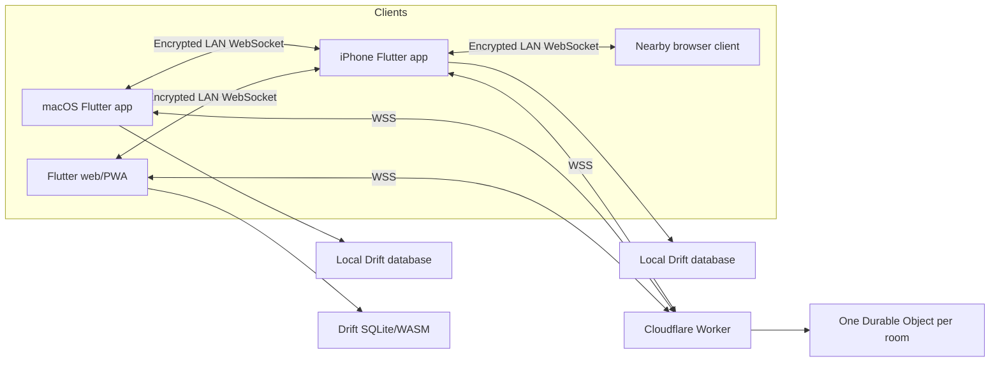
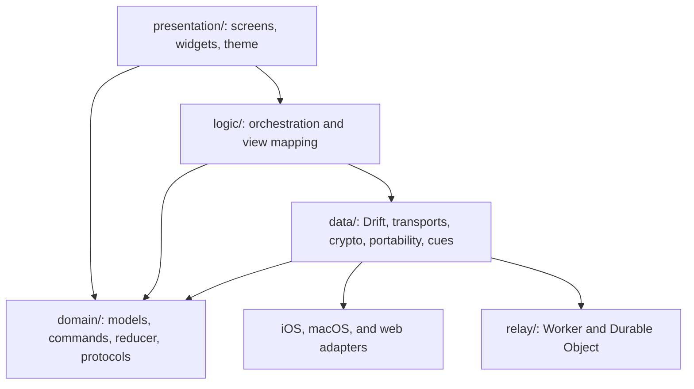
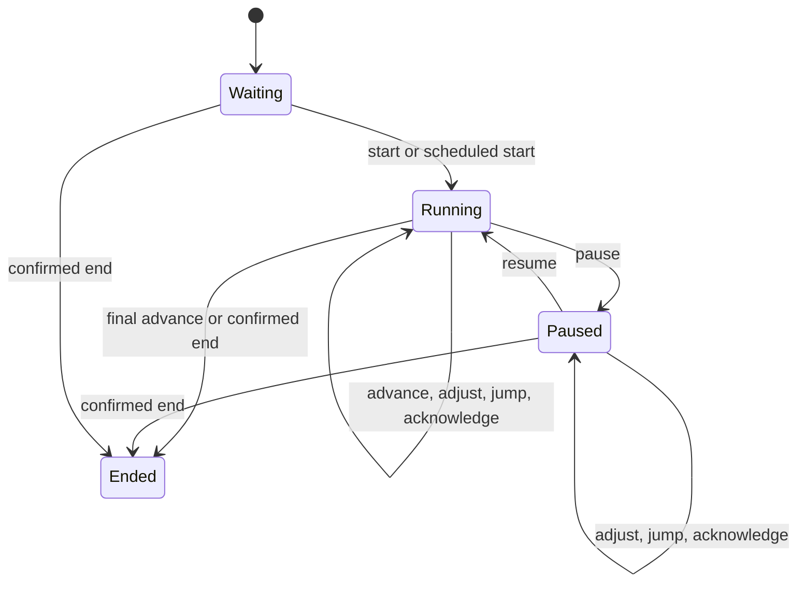
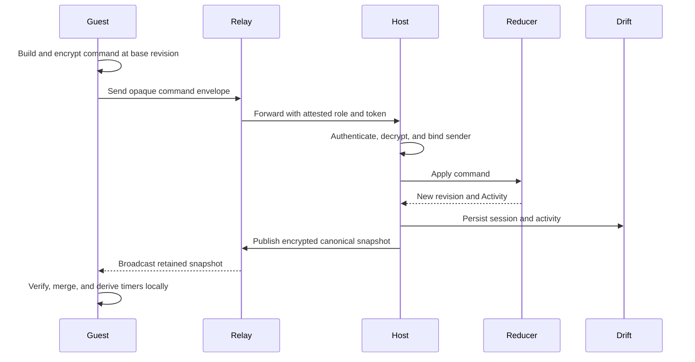
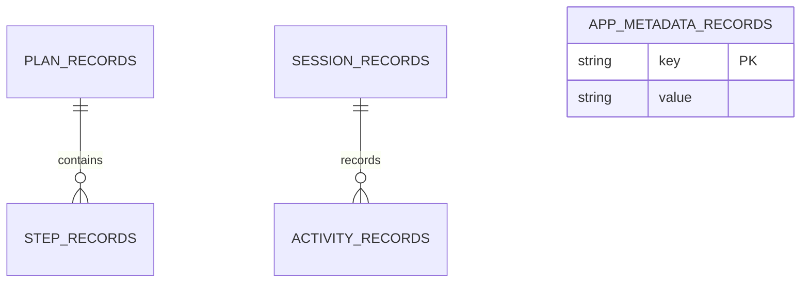

# Architecture

ChronoSync is a local-first Flutter application with a shared Dart codebase for
iPhone, macOS, and web/PWA. Live sessions are host-authoritative: participant
devices and relays display and request changes, but only the active host
serializes commands and publishes canonical state.

## System Overview

Important entry points:

- `chronosync/lib/main.dart` — application composition, startup migration,
  invitation bootstrap, and solo recovery.
- `chronosync/` — Flutter package and native/web runners.
- `relay/` — optional online room coordinator.
- `chronosync/ios/Runner/NearbyHostService.swift` — iPhone LAN server.
- `chronosync/tool/nearby_client/` — source for the bundled nearby web client.
- `.github/workflows/ci.yml` — cross-platform quality gates.

Supported MVP targets are iPhone, Mac, and web. Nearby hosting is iPhone-only.
Apple Watch is planned but not implemented.

## Application Layers

- `lib/domain/plan/` defines immutable `Plan`, `Step`, `CueProfile`, and
  `PlanSnapshot` types.
- `lib/domain/session/` defines live state, commands, activities, reducer,
  protocol, and transport contracts.
- `lib/logic/live_session/` coordinates host and guest session lifecycles and
  maps domain state to presentation.
- `lib/data/database/` contains the Drift schema and migrations.
- `lib/data/repositories/` owns plans, history, identity, and preferences.
- `lib/data/transports/` implements LAN/online transport and message crypto.
- `lib/data/portability/` implements `.chronosync` archive and CSV exchange.
- `lib/core/` contains clocks, UTC serialization, invitation handling,
  fullscreen abstraction, and platform utilities.
- `lib/presentation/` contains responsive screens, role views, and the design
  system.

Dependencies point inward: presentation and data may depend on domain
contracts, while domain code stays independent of Flutter widgets, databases,
platform channels, and Cloudflare.

## Core Domain Contracts

A `Plan` is editable local content. Starting a session embeds an immutable
`PlanSnapshot`, so later plan edits cannot rewrite history. `LiveSession` is
immutable, revisioned, and replayable.

`SessionReducer` is the only domain state-transition boundary. Each command has
a unique ID and `baseRevision`; duplicate command IDs are idempotent. Every
accepted command creates one ordered `Activity` and increments the canonical
revision. The host controller queues concurrent requests before reduction.

Authorization is enforced in the reducer:

| Role | Capabilities |
| --- | --- |
| Host | Every session and role-management action. |
| Controller | Pause/resume, advance, adjust, jump, and acknowledge. |
| Participant | Acknowledge the current step. |
| Display | Read-only. |

Timers are derived from authenticated timestamps, accumulated pauses, and
adjustments. A local 250 ms presentation ticker redraws the screen; it does not
send network timer ticks. Shared snapshots carry at most the 64 most recent
activities, while the host's local history remains complete.

## Live-Session Orchestration

`LiveSessionController` supports four construction paths: `createSolo`,
`recoverSolo`, `hostShared`, and `joinShared`. It coordinates reducer calls,
persistence, transport messages, cues, reconnects, clock-offset sampling,
scheduled starts, and auto-advance.

Guests freeze displayed timing and show stale state when connectivity or host
authority is lost. Reconnection restores updates only after authenticated host
presence and a valid snapshot return. There is no automatic leader election or
host failover.

## Persistence and Migration

Drift schema version 2 stores plans, steps, sessions, activities, and metadata.

Native platforms use SQLite. Web uses `sqlite3.wasm` through
`web/drift_worker.js` and browser storage. Step positions are unique per plan;
activity revisions are unique per session; dependent rows use cascading
deletes.

`data/migration/legacy_hive_migration.dart` performs a transactional,
retry-safe Hive-to-Drift migration. It leaves legacy Hive data intact, commits
the completion marker with the imported rows, preserves cues and auto-advance,
and splits legacy series that exceed the 250-step limit.

Startup recovery restores at most one valid active solo session: the newest
waiting, running, or paused record owned by the local host, with no participants
and a complete activity history. Other active rows, including shared sessions,
are discarded because host authority and transport credentials are deliberately
not persisted.

## Transport Implementations

All transports implement `SessionTransport`, exposing connection state,
ordered messages, authenticated peer context, command submission, role changes,
durable revocation, and shutdown.

- `InMemoryTransport` supports deterministic tests and previews.
- `LanHostTransport` bridges Flutter to the iPhone native server.
- `LanClientTransport` joins a nearby WebSocket session.
- `OnlineRelayTransport` handles Cloudflare WebSockets, heartbeats, reconnects,
  host presence, and encrypted envelopes.

### Nearby

Flutter communicates with iOS on method/event channel
`com.chronosync/nearby_host`. `NearbyHostService.swift` uses
`Network.framework`, `NWListener`, and Bonjour service `_chronosync._tcp`. It
serves `/`, `/client.js`, `/health`, and `/ws`. Hosting requires an awake,
foreground iPhone.

The nearby client source is `tool/nearby_client/main.dart`; its compiled output
is `assets/nearby_client/client.js`. Regenerate it with `make nearby-client`.

### Online

The relay exposes room creation, CORS-protected WebSocket routing, host
presence, bounded retention, role overrides, device revocation, and expiry. A
single Durable Object serializes each room. `OnlineRoomService` creates the room
and a separate local session encryption key; `OnlineRelayTransport` handles the
encrypted session protocol. See [Relay development](relay.md).

## Security and Trust Boundaries

These properties are architectural contracts:

- Online app and relay endpoints use HTTPS/WSS.
- Invitation secrets are stored in URL fragments and scrubbed from browser
  history immediately.
- Role capabilities are bearer secrets sent as WebSocket subprotocols, not URL
  queries.
- `SessionEnvelopeCrypto` uses AES-256-GCM and authenticates protocol version,
  session, message, sender, revision, timestamp, and message kind as associated
  data.
- Online messages receive a second encrypted wrapper that hides the inner
  `SessionEnvelope`, including its raw sender device ID and payload. The relay
  still sees routing metadata required for coordination: `snapshot` versus
  `command`, message ID, revision/base revision, timestamp, nonce, and
  ciphertext.
- Room-scoped device tokens are HMAC-SHA-256 values derived locally; the relay
  never receives the raw local device ID.
- The relay retains hashes, opaque tokens, role overrides, blocked-token
  tombstones, revision metadata, and latest ciphertext—not decrypted plans.
- Public invitations grant Participant or Display; the host manages Controller
  authority.
- Nearby payloads remain application-encrypted, but browser traffic is HTTP/WS
  and assumes a trusted Wi-Fi network.

Never log request bodies, WebSocket frames, capabilities, device tokens,
ciphertext, session secrets, or private plan content. Report vulnerabilities
using [SECURITY.md](../../SECURITY.md).

Current operational bounds include 50 guests plus one host, 10 controllers,
250 retained role overrides, 250 blocked tokens, 256 KiB encrypted payloads,
320 KiB frames, 120 messages per 10 seconds per connection, a 30-second socket
lease, 24-hour online capability/inactivity lifetimes, and eight-hour nearby
invitations.

## Platform Integrations

- iOS nearby hosting/audio: `ios/Runner/AppDelegate.swift` and
  `ios/Runner/NearbyHostService.swift`.
- iOS permissions: `ios/Runner/Info.plist` and
  `ios/Runner/PrivacyInfo.xcprivacy`.
- macOS fullscreen, sleep prevention, and quit confirmation:
  `macos/Runner/MainFlutterWindow.swift`, `macos/Runner/AppDelegate.swift`, and
  `lib/core/platform/mac_live_activity.dart`.
- Web invitation bootstrap/database worker: `web/invitation_bootstrap.js`,
  `web/drift_worker.dart`, and `web/sqlite3.wasm`.
- Cross-platform fullscreen: `lib/core/platform/display_fullscreen*.dart`.
- Live audio/haptic cues: `lib/data/services/live_cue_service.dart`.

## Generated and Legacy Code

Never hand-edit `app_database.g.dart`, `*.mocks.dart`, `web/drift_worker.js`, or
`assets/nearby_client/client.js`. Use `make generate`, `make drift-worker`, and
`make nearby-client`.

The active MVP is built on `domain/session/`, `Plan`, Drift repositories,
`LiveSessionController`, and `MvpAppShell`. The following are older parallel
implementations and are not wired into `main.dart`:

- `domain/run_session/`;
- `logic/live_timer_bloc/` and `logic/series_bloc/`;
- `presentation/screens/series_list_screen.dart`;
- `presentation/screens/event_list_screen.dart`;
- `presentation/screens/live_timer_screen.dart`.

Legacy Hive models remain necessary for migration. Do not add new MVP behavior
to the old `Series`/`Event` runtime.
