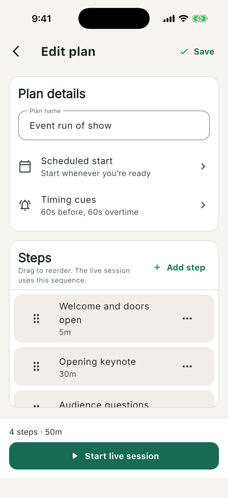
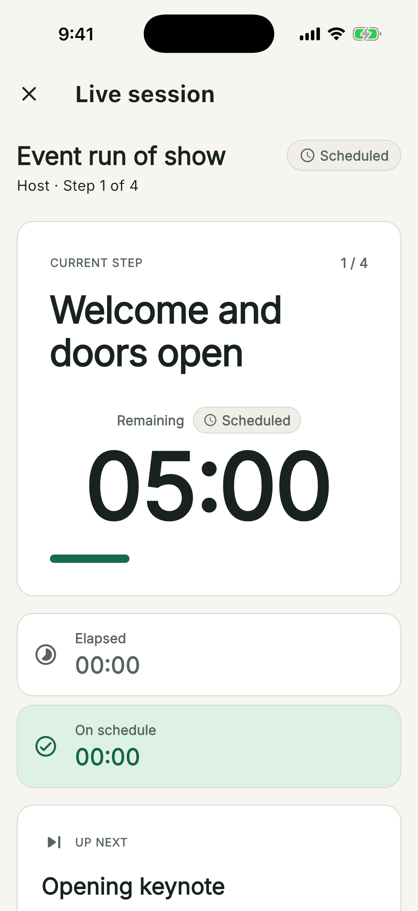

# Using ChronoSync on iPhone

The iPhone app is the complete mobile experience and the only version that can
host a nearby, Internet-free session. It also supports solo and configured
online sessions, every guest role, sound, visual cues, and native haptics.

## Create and Edit on iPhone

1. Open the app and select **Plans**.
2. Select **Create a plan**, or choose **Start with an event example** for a
   ready-made walkthrough.
3. Enter the Plan name and add timed Steps.
4. Scroll through the editor to set **Scheduled start**, **Timing cues**,
   auto-advance, and any per-Step cue overrides.
5. Select **Save**.

The bottom bar provides **Plans**, **History**, and **Settings**. The Plan
library menu contains import and export actions; iPhone presents the system
picker or share sheet when a file is involved.

## Run on This iPhone

1. Select **Start** on a Plan.
2. Choose **Just me**.
3. Select **Start session**.
4. Keep the screen available for cues and controls. Use **Pause**, **Advance**,
   time adjustments, **Jump to step**, and **Got it** as needed.
5. Finish the final Step and review the summary.

If an unfinished solo session exists when the app reopens, choose **Resume**
or **Discard session**. A running timer includes the time the app was closed;
a paused timer reopens paused. Shared sessions are not recovered this way.

## Host a Nearby Team Without Internet

Nearby sessions use the current Wi-Fi network. The host iPhone serves the
small join page itself, so participants do not need Internet access.

1. Connect the host and guest devices to the same Wi-Fi network.
2. Open the Plan and select **Start**.
3. Choose **Nearby team**.
4. If iOS asks for Local Network access, allow it. ChronoSync needs this to
   advertise and serve the session.
5. In **Session lobby**, show or share the **Join as participant** invitation
   for teammates. Use **Open display** for a read-only timing screen.
6. As devices appear under **People**, optionally promote a Participant to
   **Controller**, change a role, or remove a device.
7. Enable **I'm ready**, then select **Start session**.

Keep ChronoSync awake, open, and in the foreground for the entire nearby
session. Locking the phone, switching away for too long, changing networks, or
losing Wi-Fi can make guests show **Connection stale** and freeze timing until
they reconnect. Nearby invitations expire after eight hours.

Scanning a nearby QR opens the lightweight join page in a browser. ChronoSync
does not contain an in-app QR scanner. The code displayed in the lobby is a
visual room reference; there is currently no screen for joining by code.

## Host an Online Team

Choose **Online team** instead of Nearby. Share the expiring encrypted
Participant or Display link, set roles in the lobby, mark **I'm ready**, and
start. Keep the iPhone app open because it remains the authoritative host.

If **Online team** is locked, that installed build was not configured with the
ChronoSync online service. Solo and nearby hosting still work.

## Join from the Full iPhone App

1. Copy the invitation sent by the Host.
2. Open **Plans** and select **Join session**.
3. Paste the link manually or select **Paste from clipboard**.
4. Enter **Name for this session** when joining as a Participant, then select
   **Join session**. A Display invitation does not ask for a name.
5. Keep the app open until the Host ends the session or you disconnect.

For a nearby QR, using the browser page is the intended path. It asks for a
temporary name and offers **Join live session**; a Display QR offers **Open
display** instead.

## iPhone Cue Notes

- Visual, sound, and haptic cues can all be enabled in the Plan's **Timing
  cues**.
- The host device delivers its own cues; a Participant receives the role view
  and acknowledgement control.
- Silent mode, focus settings, output volume, and accessibility preferences
  can affect what you hear or feel. Always rehearse cues on the actual event
  device.
