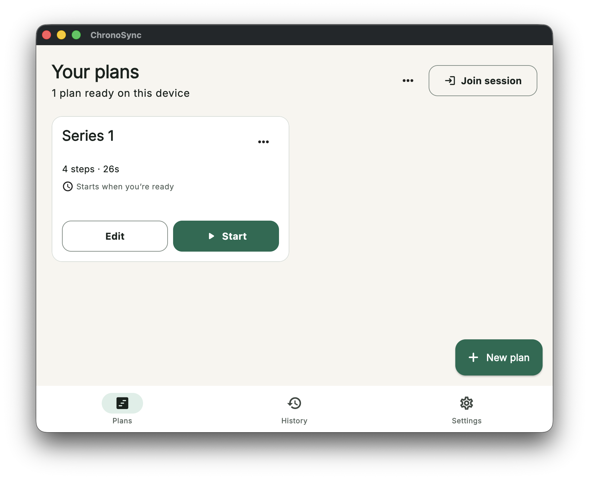
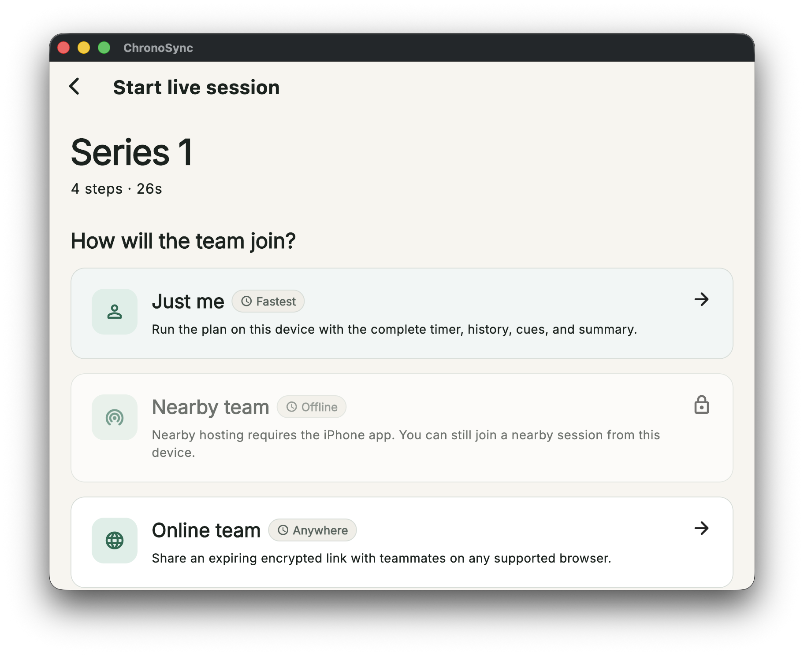
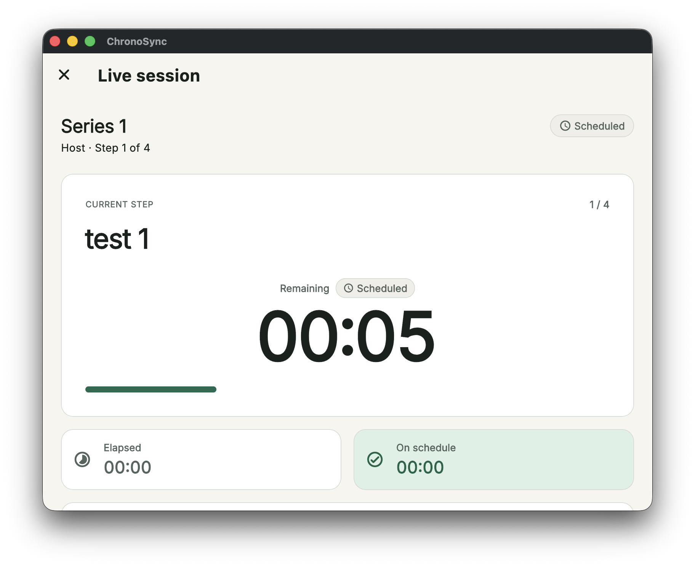

# Using ChronoSync on Mac

The native Mac app includes the full Plan editor, local History, solo and
configured online hosting, every shared-session role, import/export, audio and
visual cues, and a native fullscreen Display. It can join—but not host—a nearby
session.

## Create and Run on Mac

1. Open ChronoSync and choose **Plans**.
2. Select **New plan**, or select **Start with an event example** if the
   library is empty.
3. Add and reorder Steps, configure timing cues and an optional scheduled
   start, then select **Save**.
4. Select **Start** on the Plan card.
5. Choose **Just me** for a rehearsal or **Online team** for a shared room.

The disabled **Nearby team** row is expected: nearby hosting requires iPhone.
If **Online team** is disabled, the build has no configured online service.

## Operate a Live Session

The Mac controller uses the same controls as iPhone and web: **Advance**,
**Got it**, **Pause / Resume**, quick and custom time adjustments, and **Jump to
step**. A Host also has **End session**. Mac provides visual and sound cues but
does not provide haptics.

Keep the app open while hosting. If you try to quit during a Live session,
ChronoSync asks **Quit during the live session?** Choose **Keep Session Open**
to protect the room, or **Quit Anyway** only when you intend to disconnect it.

## Join on Mac

1. Copy the complete invitation link.
2. Select **Join session** in ChronoSync.
3. Paste the link or select **Paste from clipboard**.
4. Enter a temporary session name when prompted and select **Join session**.

Native Mac does not currently open ChronoSync invitations automatically from
the browser. Pasting into **Join session** is the reliable path. A nearby link
also requires the Mac to be on the host iPhone's Wi-Fi network.

## Use Mac as the Display

Join with the Host's **Open display** invitation. The Display is read-only and
shows a large current Step, remaining time, next Step, and schedule variance.
Use its fullscreen control for a projector or confidence monitor, then use
**Exit full screen** or leave the Display when finished.

## Save and Move Files

Mac uses native Save dialogs for `.chronosync` archives and session CSVs. Use
**Export** on one Plan or **Export all plans** in the library menu, choose a
location, and import that archive on another device. History is not included
in a Plan archive.
