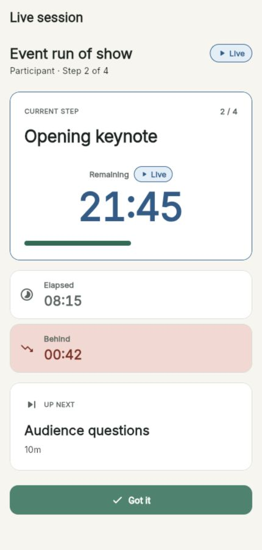

# Shared Sessions and Roles

A shared session has one authoritative Host and one or more Controllers,
Participants, or Displays. Create role-specific invitations so every device
gets only the controls it needs.

## Choose Nearby or Online

| Mode | Host | Guests | Internet | Invitation lifetime |
| --- | --- | --- | --- | --- |
| **Nearby team** | Foreground iPhone app | Same Wi-Fi; browser, iPhone, Mac, or web | Not required | 8 hours |
| **Online team** | iPhone, web, or Mac when configured | Any supported device with Internet | Required | 24 hours |

The Host app or page must remain open in either mode. There is no automatic
Host failover.

## 1. Prepare the Lobby

1. Start a Plan and choose **Nearby team** or **Online team**.
2. In **Session lobby**, use **Join as participant** for teammates who should
   follow and acknowledge Steps.
3. Use **Open display** for a projector or read-only status screen.
4. Ask guests to scan the appropriate QR code or select **Copy link** / **Share**.
5. Watch **People** for connected devices.
6. Before starting, use a person's role menu to change them to **Controller**,
   **Participant**, or **Display**. Use the remove action to revoke that
   device's access.
7. Enable the Host-only **I'm ready** checkbox, then select **Start session**.

The lobby's short session code helps people visually confirm that they are
looking at the same room. There is no join-by-code form in the current app, so
always share the QR code or full invitation link.

Role management is available in the pre-session lobby. During the run, the
Host's **Connected people** view is read-only.

## 2. Join as a Teammate

### Full iPhone, Web, or Mac App

1. Select **Join session**.
2. Paste the complete invitation or select **Paste from clipboard**.
3. Confirm that the form says **Invitation ready** and shows the intended role.
4. Enter **Name for this session** for a Participant invitation.
5. Select **Join session** and wait for the Host's encrypted snapshot.

### Nearby Browser Page

1. Scan the Host's QR code while connected to the same Wi-Fi.
2. For a Participant invitation, enter **Your name** and select **Join live
   session**.
3. For a Display invitation, select **Open display**; no name is required.
4. Keep the page open. If needed, select **Reconnect** after the Host or Wi-Fi
   becomes available again.

The lightweight nearby page is deliberately smaller than the full app. If the
Host promotes it to Controller, it provides **Pause / Resume**, **−1 min**,
**+1 min**, and **Advance**, but not Custom adjustment, Jump, or End.

## 3. Understand the Roles

| Action | Host | Controller | Participant | Display |
| --- | :---: | :---: | :---: | :---: |
| See current/next Step and timing | Yes | Yes | Yes | Yes |
| Tap **Got it** | Yes | Yes | Yes | No |
| Pause/resume and Advance | Yes | Yes | No | No |
| Adjust remaining time | Yes | Yes | No | No |
| Jump to another Step | Yes | Yes in full app | No | No |
| Finish the final Step | Yes | Yes | No | No |
| End the session early | **Yes** | No | No | No |
| Change roles or remove devices | **Yes, in lobby** | No | No | No |

### Participant

The Participant view emphasizes the current Step, remaining time, variance,
next Step, and one large **Got it** action.

**Got it is not Advance.** It records one acknowledgement for the current Step
so the Host and Controllers can see who confirmed it and when. It never moves
the runbook, even if everyone acknowledges.

### Controller

A Controller can run the timing workflow without getting Host authority. In
the full app it can pause/resume, Advance, use quick or Custom adjustments,
Jump to a Step, acknowledge, and finish the final Step. It cannot end the room,
change roles, or remove people.

### Display

The Display is a control-free, high-contrast view intended for a projector,
large monitor, backstage confidence display, or shared status screen.

On web and Mac, use the fullscreen icon. The Display cannot send commands or
acknowledgements.

## 4. Handle Connection Problems

If a guest can reach the relay or Wi-Fi but no longer has a verified Host, it
shows **Connection stale**. ChronoSync freezes its timer and disables commands
rather than guessing. Keep the app/page open, restore the original connection,
and allow automatic reconnection. There is no leader election.

For nearby sessions, verify that the Host iPhone is unlocked, ChronoSync is in
the foreground, Local Network access is allowed, and every device remains on
the same Wi-Fi. For online sessions, verify Internet access and keep the Host
page or app open.

## 5. Finish the Room

On the final Step, a Host or Controller selects **Finish session**, confirms
**Finish live session?**, and opens the summary for everyone. Only the Host can
use **End session** to stop early. Ending also revokes the active invitation.

Export the complete CSV from the Host. A late joiner may have only recent
activity, display **Incomplete activity history**, and have CSV export disabled.
