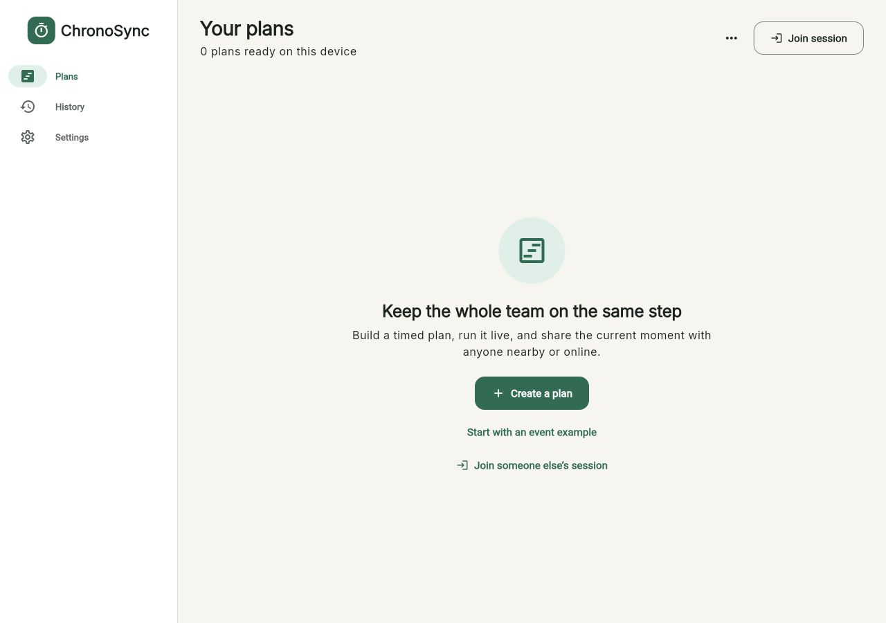
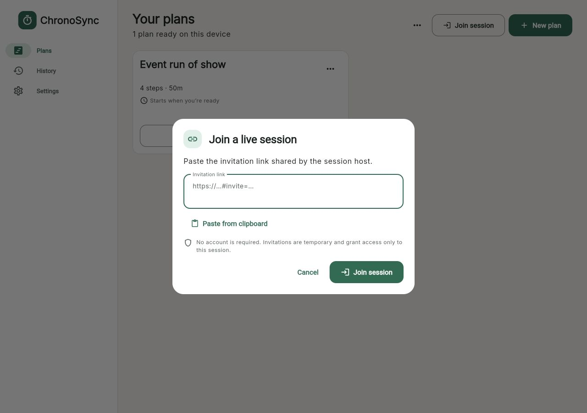
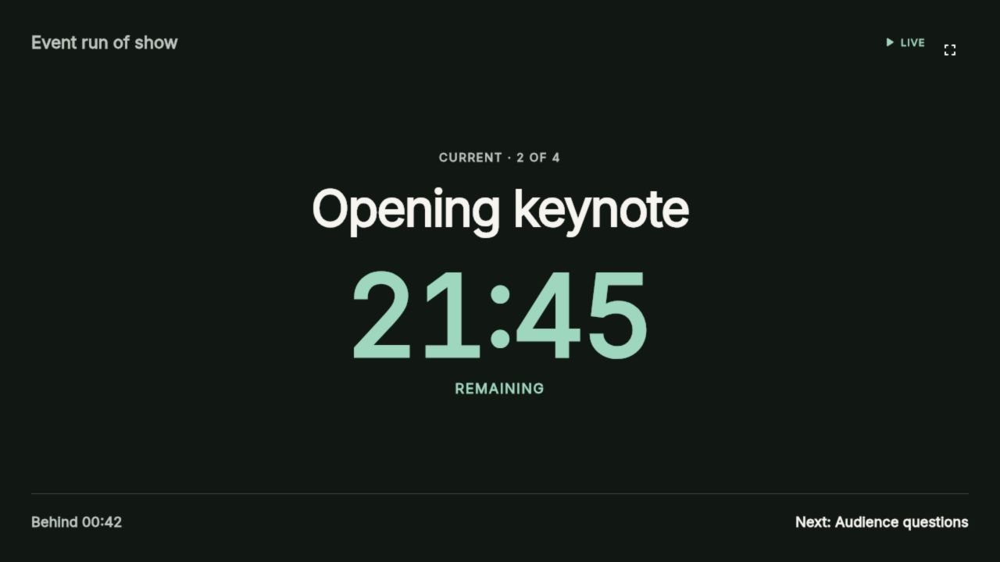

# Using ChronoSync on the Web

The web/PWA version includes the complete Plan library, editor, solo runner,
configured online hosting, all guest roles, History, and import/export. It can
join a nearby session but cannot host one.

## Open or Install the PWA

1. Open the ChronoSync web address in a supported Safari, Chrome, or Edge
   browser.
2. Keep using it in a tab, or use the browser's **Install app** / **Add to Home
   Screen** action when available.
3. Open **Settings**, enter this browser's **Display name**, and select **Save
   name**.

Plans and History are stored in this browser profile for this site. Private
browsing, clearing site data, or using another browser profile creates a
separate local library. Export important Plans before clearing browser data.

## Create and Run a Plan

1. Select **Create a plan** or **Start with an event example**.
2. Add, edit, and reorder Steps; configure scheduling and cues; select **Save**.
3. Select **Start**.
4. Choose **Just me** for a local rehearsal or **Online team** for a shared
   room.

**Nearby team** is disabled on the web because only iPhone can host nearby.
**Online team** is enabled only in a deployed build configured with the secure
online relay. A locked Online option does not prevent solo use or joining a
session.

## Join a Session

Opening a valid web invitation takes you directly to **Join ChronoSync** and
removes the secret invitation fragment from the visible URL. You can also:

1. Select **Join session** in the Plan library.
2. Paste the complete invitation into **Invitation link**, or use **Paste from
   clipboard**.
3. Select **Join session**.
4. Enter **Name for this session** for a Participant invitation. Displays join
   without a name.

For nearby sessions, the link must be opened while connected to the same Wi-Fi
as the host iPhone. The page is served by that iPhone and works without
Internet.

## Keep Web Timing Reliable

- Keep the ChronoSync tab open. Browsers do not provide reliable closed-page
  session alerts.
- The Start or Join gesture unlocks audio. Visual and sound cues work while the
  page remains open; browser autoplay, mute, and power-saving settings can
  still affect sound.
- If the Host disappears, the page shows **Connection stale** and freezes the
  last verified state. Leave the page open while it reconnects.
- Use the fullscreen control in a Display view. Press `Esc` or use **Exit full
  screen** to leave browser fullscreen.

## Import, Export, and History

The Plan library menu provides **Import .chronosync** and **Export all plans**;
each Plan menu provides **Export**. The browser downloads the archive or opens
its supported share flow. Session summaries offer CSV download.

Open **History** to review recent ended sessions stored in this browser. A
late-joining guest may see **Incomplete activity history** and cannot export a
complete CSV; use the Host's export instead.
